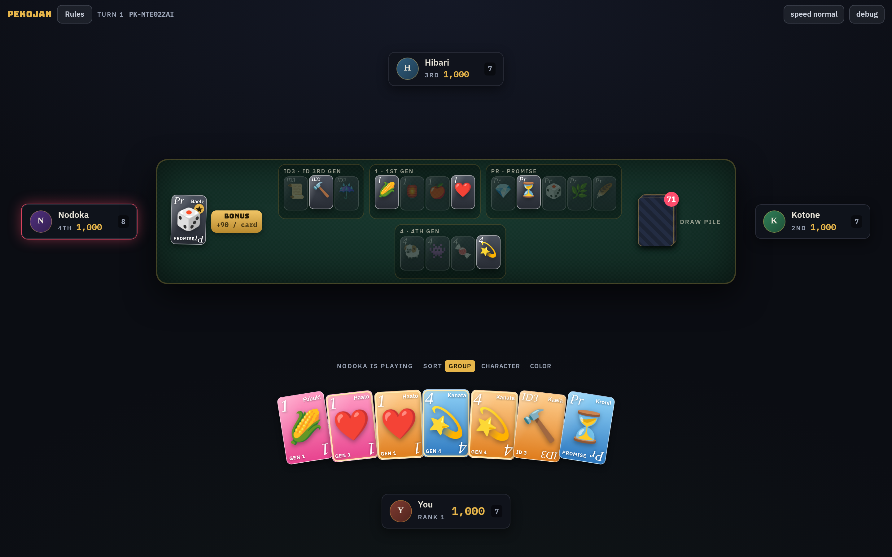

# Pekojan — Midnight Parlor Card Table

A fully playable web recreation of the gameplay of "Pokajan!" from hololive Dreams,
using the hololive generations roster with original UI and placeholder portraits.
No proprietary hololive assets, audio, artwork, or code are used or bundled.

Four players. Poker × mahjong energy. Completing a hand does **not** end the round —
you shout **PEKOJAN**, collect points, refill your hand instantly, and keep going.



## Quick start

```bash
npm install
npm run dev      # play at http://localhost:5173
npm test         # 55 unit/integration tests
npm run build    # production bundle in dist/
```

## Game modes

- **Freestyle** — untimed play, as fast or slow as you like.
- **Classic** — original Pokajan turn timing:
  - discard turn = **10 s** + remaining compensation pool
  - pekojan turn = **5 s** + remaining compensation pool
  - each player gets **20 s of shared compensation time** per match; any time
    spent past the base drains the pool; expiry force-passes / force-discards.
    The clock only runs while you actually hold the device (pass screens are free).

## The rules in one screen

| Hand | Mixed | Same color |
|---|---:|---:|
| Three of a kind | 120 | 840 |
| 3-member group | 180 | 480 |
| 4-member group | 300 | 840 |
| 5-member group | 480 | 1800 |

- Every character has 9 theoretical cards (3× pink / blue / orange).
- Each match uses exactly **100 random cards** drawn from **4 random groups**
  (minimum 14 characters combined) — you can never be sure the card you need
  actually exists.
- Groups sharing members never co-exist (e.g. 1st Gen ⊼ Gamers — Fubuki).
- **Deal**: 7 cards per player; draw pile starts at 72.
- **Bonus character**: one character adds **+90 per copy** in any winning hand.
- **Self-draw Pekojan**: paid by all three opponents (⅓ each, clamped at 0).
- **Discard claim**: complete your hand off someone's fresh discard — that player
  pays everything.
- **Double-calls**: if two players can claim the same discard, the higher-value
  hand wins; on a tie the **fastest call** wins (your reaction time vs. the AI's).
- After a win: remove the cards, redraw replacements immediately, then re-check —
  **chains** are allowed. Passing a valid Pekojan is always legal (no penalty).
- When several hands are available, the POKAJAN button auto-plays the
  highest-scoring one; you only choose between **equal-value** alternatives.
- Game ends when a player hits **0 points** or the deck is empty. Highest score wins.

## Features

- Deterministic seeded matches (`seed` field on the main menu) — reproducible runs
  and replays.
- **Offline multiplayer**: 1–4 human players on one device (pass-and-play) with a
  privacy screen between human turns; remaining seats are AI.
- Four AI difficulty levels (easy / normal / hard / **expert**). AI only ever reads
  public information; its randomness derives from the match seed.
  Expert adds real card counting (exact unseen-copy numbers from discards/melds/your
  hand), probability-weighted discard EV over a draw horizon, hypergeometric
  opponent-threat inference, and declare-vs-pass expected-value analysis for upgrade
  fishing.
- Claim window with configurable countdown (main menu, default 6 s, freestyle
  only) and true double-call racing. In classic the claim decision runs on the
  claimant's clock (pekojan base + compensation pool) per the timings above.
- Card availability tracker: tap a discarded card or long-press / right-click a hand
  card for the **3×3 copy grid** — one row per color, one cell per physical copy:
  ✕ = used (Pekojan/discard), bordered = in your hand, open = possibly unseen
  (may not exist in this match at all).
- Winning-hands guide with live near-completion hints; blinking borders on hand
  cards that are one card away from completing a hand.
- Player history panels (tap any seat), table that rotates to the revealed player,
  discard piles (last 7) in front of each player.
- Pekojan celebration overlays with chain banners (celebrated exactly once each),
  score-delta flashes.
- Synthesized original sound effects (WebAudio, no assets), disableable.
- Tutorial, lifetime statistics and settings (persisted via localStorage), debug
  overlay with live AI evaluations.
- Responsive layout: fanned hand with the drawn card set apart, explicit Confirm
  Discard button, long-press inspection on mobile.

## The roster

15 hololive generations (0th Gen → ReGLOSS) as the group pool, each with its oshi-mark
emoji as the card portrait and its generation code (0, 1, Ga, My, ID1, Re, …) as the
card corner crest. Swap `src/data/characters.ts` to re-skin the entire game; set
`Character.image` on any member to replace the emoji portrait with real art.

## Architecture

```
src/
  game/           ← pure game logic (no React, no DOM)
    types.ts        domain model incl. GameAction/GameState (multiplayer-ready commands)
    rng.ts          mulberry32 seeded RNG; state lives inside GameState (serializable)
    deck.ts         pool generation + the 100-card rule + dealing
    scoring.ts      data-driven scoring table, calculatePekojanScore()
    hands.ts        findValidPekojans(): enumerates EVERY legal combo (incl. duplicate
                    variants) + visible-identity dedupe for the picker
    payments.ts     integer-safe ⅓ splitting (documented policy) + zero clamping
    claims.ts       discard-claim eligibility; double-calls: points, then fastest call
    engine.ts       reduce(state, action): explicit state machine; settles automatic
                    phases eagerly; group selection (exclusivity + 14-character minimum)
    view.ts         hot-seat helper: which human owes the next decision
    invariants.ts   invariant checker (card uniqueness, totals, no negatives)
  ai/
    evaluator.ts    keep-value / discard-danger heuristics (public info only)
    expert.ts       expert brain: card counting, draw probabilities, opponent-threat
                    inference, declare-vs-pass EV
    index.ts        easy / normal / hard / expert policies emitting GameAction commands
  data/
    characters.ts   hololive generations, oshi-mark emoji, generation codes — swap this
                    file to re-skin the whole game
  store/
    game.ts         zustand wrapper owning one match; schedules AI decisions as actions;
                    classic-mode turn clocks and compensation pools
    settings.ts     persisted settings (mode, difficulty, seats, timers, sound) +
                    lifetime statistics
  components/       Card (reference design), PlayerSeat, TableCenter, HandArea, overlays,
                    claim/pass-device dialogs, classic turn timer, debug panel
  screens/          MainMenu (mode/seats/seed), Game (+ResultsOverlay)
  audio/sfx.ts      tiny WebAudio synth
tests/              hands/scoring/engine/claims/store/UI (jsdom) integration tests
```

### Multiplayer readiness

The engine reduces `(GameState, Action) → GameState`; every human/AI move is a plain
serializable command (`DECLARE_PEKOJAN`, `DISCARD`, `CLAIM_DISCARD`, …). A server could
run the same reducer authoritatively and broadcast states / replay actions to
reconstruct matches. Automatic steps (draws, shuffles, payment splits) are derived
inside the reducer from the seed. Classic-mode timers live outside `GameState` (they
are presentation/fairness concerns, not game outcomes).

### Payment rounding policy

Self-draw: base = ⌊value/3⌋ per opponent, remainder distributed to opponents nearest
after the winner in turn order. Payments clamp at each payer's current score; the
winner receives exactly what was moved (books always balance, scores never go below 0).

### State machine phases

`SETUP → DEALING → TURN_START → DRAWING → SELF_PEKOJAN_DECISION? → DISCARDING →
DISCARD_CLAIM_WINDOW? → DISCARD_CLAIM_RESOLUTION → TURN_END → …` plus
`PEKOJAN_RESOLUTION` / `REPLACEMENT_DRAW` sub-steps during chains, ending at
`GAME_OVER`. `reduce()` always rests at an input-required phase or `GAME_OVER`.

## Debug mode

Toggle **debug** in the top bar during a match to inspect seed, phase, deck order,
all hands, candidate detection, and live AI evaluations. Off by default.

## Legal

This project's code is released under the [MIT License](LICENSE). Mechanics
recreation for personal/educational use. hololive names and oshi marks belong
to COVER Corp — this project bundles no hololive assets, artwork, or audio;
portraits are emoji placeholders and sounds are synthesized.
